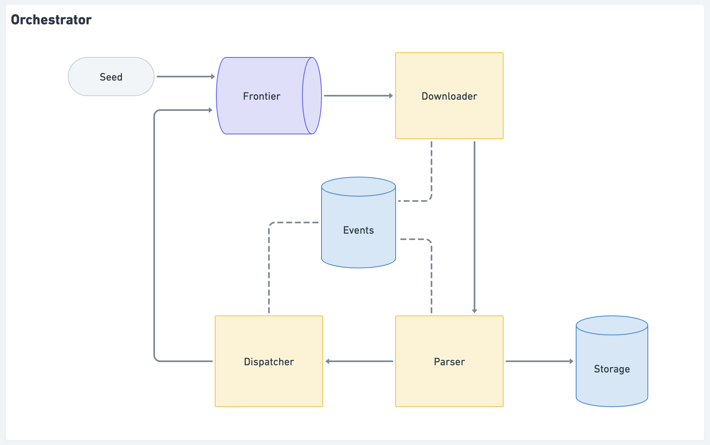

# Web Crawler

Given a starting URL, the crawler visits each URL it finds on the same domain. It prints each URL visited, and a list of links found on that page. The crawler is limited to one subdomain - so when you start with `*https://somedomain.com/*`, it will crawl all pages on the `somedomain.com` website, but not follow external links, for example to `otherdomain.com` or `community.somedomain.com`.

## Building

For rapid usage, please build as follows:

```bash
$ go build -o webcrawler .
```

## Usage

The entry point for the application is a [Cobra](https://github.com/spf13/cobra) app. It has only one command (`get`) as of now.

Please use the following to learn more about application:

```bash
$ ./webcrawler -h
```

and

```bash
$ ./webcrawler get -h
```

The application has several options:

- `timeout`: this determines for how long the web crawler should run.
- `output`: it can be empty (stdout) or a filename to write the output to.
- `format`: it can be "raw" (a shallow tree), "json", or "json-formatted".
- `retries`: how many attempts per individual download in case of request failure.
- `backoff`: how long the client should wait before attempting a retry after a failed request.
- `backoff-multiplier`: how much the backoff duration should increase between each retry attempt.
- `verbose`: if not provided, logs are omitted.
- `workers`: number of concurrent workers to process URLs.

This is a possible usage:

```bash
$ ./webcrawler get -t 5s -o output.txt https://www.theguardian.com/uk
```

A quick look at `output.txt` will reveal the following:

```bash
$ cat output.txt| jq . | head -n 10                 
[
  {
    "url": "https://www.theguardian.com/?filterKeyEvents=false&page=with:block-64610f408f08e7793c5e2e2a",
    "contentType": "text/html; charset=UTF-8",
    "children": [
      "https://www.theguardian.com/society/2023/may/14/overhaul-uk-fertility-law-keep-up-advancements-expert",
      "https://www.theguardian.com/world/2023/may/14/thousands-evacuated-as-cyclone-mocha-makes-landfall-in-myanmar",
      "https://www.theguardian.com/tone/letters/all",
      "https://www.theguardian.com/uk/culture",
      "https://www.theguardian.com/uk-news/2023/may/14/red-faces-in-ireland-over-coronation-quips-by-leo-varadkar-partner",
```

## Architecture

The CLI is a wrapper for an orchestrator. Please see below a brief description of the individual components.



- Seed: is the initial URL.
- Frontier: is a message queue where URLs are added to be downloaded.
- Downloader: is a web client that consumes jobs from the Frontier.
- Parser: extracts URLs from the HTML body of a resource downloaded by the Downloader.
- Dispatcher: checks which URLs discovered by the parser still need to be downloaded.
- Events: is a database for events and metrics.
- Storage: is a database for keep the URLs and their properties (body content, children, etc.)

## Testing

There are unit tests for the individual components and a more integration like test for the Orchestrator. The current test coverage is at 84%.

Please run the tests as follows:

```bash
$ go test ./... -coverprofile=coverage.out
```

And check the test coverage using the following command:

```bash
$ go tool cover -func=coverage.out
```
